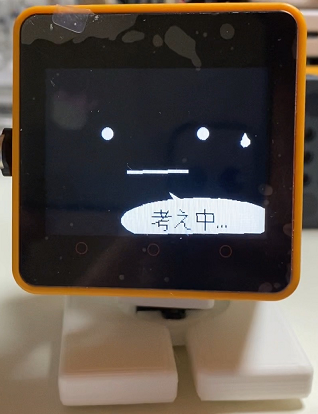

# AI_StackChan2
AIｽﾀｯｸﾁｬﾝ2です。
  

  

AIｽﾀｯｸﾁｬﾝ2の特徴 

* 音声合成にWeb版 VOICEVOXを使います。
* 音声認識に"Google Cloud STT"か"OpenAI Whisper"のどちらかを選択できます。
 

Google Cloud STTは、”MhageGH”さんの [esp32_CloudSpeech](https://github.com/MhageGH/esp32_CloudSpeech/ "Title") を参考にさせて頂きました。ありがとうございました。 
"OpenAI Whisper"が使えるようにするにあたって、多大なご助言を頂いた”イナバ”さん、”kobatan”さんに感謝致します。 
ウェイクワードには、”MechaUma”さんの[SimpleVox](https://github.com/MechaUma/SimpleVox/ "Title")ライブラリを使わせていただきました。

---

### M5GoBottom版ｽﾀｯｸﾁｬﾝ本体を作るのに必要な物、及び作り方 ###
こちらを参照してください。 
* [ｽﾀｯｸﾁｬﾝ M5GoBottom版組み立てキット](https://raspberrypi.mongonta.com/about-products-stackchan-m5gobottom-version/ "Title") 

### プログラムをビルドするのに必要な物 ###
* [M5Stack Core2](http://www.m5stack.com/ "Title") 
* VSCode 
* PlatformIO 

使用しているライブラリ等は"platformio.ini"を参照してください。 

~~【5/31の時点ではM5Unifiedの不具合の為、CoreS3では動きません。】~~ 

---

### サーボモーターを使用するGPIO番号の設定 ###
* main.cppの46行目付近、サーボモーターを使用するGPIO番号を設定してください。

### 使い方 ###

こちらを参照してください。 

* [AI_StackChan2_README](https://github.com/robo8080/AI_StackChan2_README/ "Title") 
 
 
 

---

## Program Summary
* M5Stack-based “AI Stack-chan” that records audio, runs speech-to-text (Google Cloud STT or OpenAI Whisper), sends chat to OpenAI, and speaks responses via VOICEVOX TTS.
* Includes on-device avatar/face animation, optional servo movement, wake-word handling, and a small HTTP server for settings (API keys, role, speech/face controls).
* Stores configuration in NVS/SPIFFS and can load Wi-Fi/API keys from SD card files.

## How to Use
Not verified.
* Build and flash with PlatformIO using `M5Unified_AI_StackChan/platformio.ini` (e.g., `m5stack-core2` or `esp32-s3-devkitc-1` environments).
* Provide Wi‑Fi and API keys either via SD card files (`/wifi.txt`, `/apikey.txt`) or through the device’s web UI endpoints (e.g., `/apikey`, `/role`).
* On device: use touch/buttons for STT, wake-word toggle, monologue mode, and battery report (see `src/main.cpp` for mappings).

## Completion Status
Usable: core features (STT, chat, TTS, avatar, wake word, settings server) are implemented, but it is hardware- and API‑key dependent and lacks documented, verified setup steps here.

---

## Program Summary
* Firmware project for M5Stack Core2 / ESP32-S3 that runs a Stack-chan avatar with speech, wake-word handling, and optional servo motion.
* Records audio and performs STT via Google Cloud STT or OpenAI Whisper, sends chat to the OpenAI Chat Completions API, and plays responses through the VOICEVOX Web API.
* Hosts an HTTP server for chat/face/speech endpoints and for setting API keys and role; stores settings in NVS and can load config from SPIFFS/SD.

## How to Use
Not verified.
* Build and flash with PlatformIO using `M5Unified_AI_StackChan/platformio.ini` (`m5stack-core2` default, `esp32-s3-devkitc-1` also defined).
* Provide Wi‑Fi and API keys via SD card (`/wifi.txt` with SSID + password lines; `/apikey.txt` with OpenAI/VOICEVOX/STT keys) or via the device HTTP endpoints (`/apikey`, `/role`).
* If using servos, set the GPIO pins in `M5Unified_AI_StackChan/src/main.cpp`.

## Completion Status
Usable: core runtime (STT, chat, TTS, avatar, wake word, HTTP settings) is implemented, but setup/usage relies on external docs and hardware/API-key availability.
